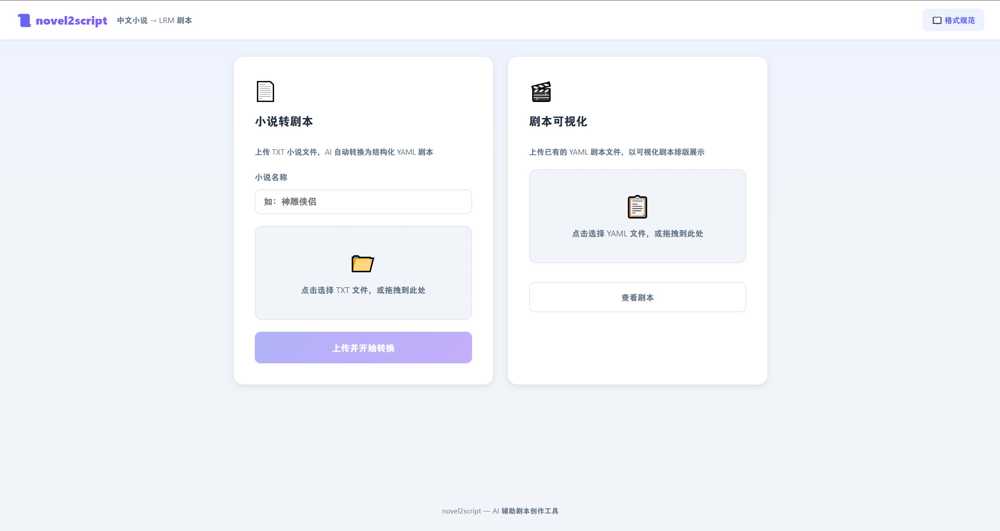
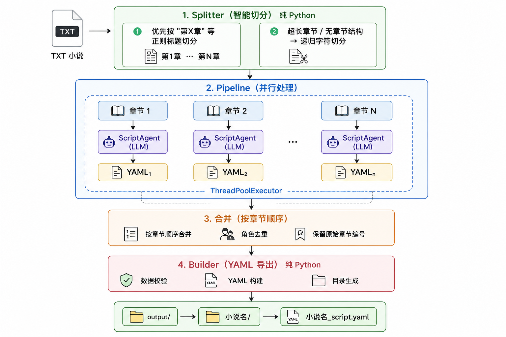

# novel2script

AI 辅助剧本创作工具：将中文网络小说自动转换为 LRM 剧本 YAML。

🎬 **[▶ 观看演示视频](https://www.bilibili.com/video/BV1yTEh6CETQ/)**



输入一篇 TXT 小说，自动按章节切分 → 多线程并行调用 LLM → 输出结构化 YAML 剧本。作者可在线预览、复制或下载，快速获得可编辑、可进一步打磨的剧本初稿。

## 功能特性

- **小说转剧本** — 上传 TXT 小说，AI 自动转换为结构化 YAML 剧本
- **剧本可视化** — 上传已有 YAML 剧本，以可视化排版展示（章节、场景、对白、动作）
- **格式规范文档** — 内置 YAML Schema 参考，作者可随时查看字段说明
- **智能切分** — 支持 UTF-8 / GBK / GB18030 / Big5 等编码自动识别，按章节正则切分
- **并行处理** — 多线程同时转换多个章节，大幅加速

## 架构



每章独立处理，互不依赖，多线程并行加速。LLM 输出的 YAML 若校验失败，会自动重试一次。

## 快速开始

```bash
# 1. 安装依赖（Python 3.11+）
pip install -r requirements.txt

# 2. 配置 API 密钥
cp .env.example .env
# 编辑 .env，填入你的 MILM_API_KEY

# 3. 启动后端
uvicorn app.main:app --reload

# 4. 启动前端（另开终端）
cd frontend && npm install && npm run dev
```

- 后端 API 文档：http://localhost:8000/docs
- 前端界面：http://localhost:3000

## 使用流程

### 小说转剧本

1. 打开 http://localhost:3000
2. 在「小说转剧本」卡片输入小说名称，选择 TXT 文件上传
3. 点击「上传并开始转换」，后台并行处理
4. 进度实时更新（每 3 秒轮询一次，显示已完成章节 / 总章节数）
5. 完成后默认显示可视化剧本视图，也可切换到原始 YAML 查看或下载

### 剧本可视化

1. 在「剧本可视化」卡片上传已有的 YAML 剧本文件
2. 点击「查看剧本」，即可以可视化排版展示
3. 支持「剧本视图」和「原始 YAML」两种模式切换

百万字小说预计需要 5–15 分钟，取决于章节数量和 LLM 响应速度。

## 项目结构

```
app/
├── main.py           # FastAPI 入口 + lifespan
├── config.py         # 配置加载（环境变量）
├── llm.py            # LLM 封装（OpenAI 兼容，指数退避重试）
├── models.py         # 数据模型（Pydantic v2，宽松 Schema）
├── api.py            # REST 端点
└── core/
    ├── splitter.py   # 编码检测 + 章节识别 + 文本切分
    ├── agent.py      # ScriptAgent — 调用 LLM，输出 YAML
    ├── builder.py    # Screenplay → YAML 文件导出
    └── pipeline.py   # 主流水线（并行转换 + 合并 + 导出）

frontend/src/
├── App.vue                     # 单页应用（双功能入口 + 转换流程 + 预览）
├── components/
│   └── ScreenplayView.vue      # YAML 可视化剧本组件
├── main.js
└── api/index.js                # Axios 封装

docs/
├── yaml-schema.md    # 剧本 YAML Schema 定义 + 设计原因
└── screenshot.png    # 前端界面截图

uploads/{小说名}/origin/  # 上传的原始 TXT 文件
output/{小说名}/          # 输出的 YAML 文件
```

## API 接口

| 方法 | 路径 | 说明 |
|------|------|------|
| GET | `/` | 健康检查 |
| POST | `/api/upload` | 上传 TXT 文件 |
| POST | `/api/convert` | 触发转换（后台异步运行） |
| GET | `/api/status/{task_id}` | 查询任务状态和进度 |
| GET | `/api/preview/{name}` | 预览生成的 YAML 内容 |
| GET | `/api/download/{name}` | 下载生成的 YAML 文件 |

任务状态值：`pending` → `processing` → `completed` / `failed`

## 环境变量

| 变量 | 必需 | 代码默认值 | 说明 |
|------|------|-----------|------|
| `MILM_API_KEY` | ✅ | — | LLM API 密钥 |
| `MILM_BASE_URL` | ❌ | `https://token-plan-cn.xiaomimimo.com/v1` | OpenAI 兼容 API 端点 |
| `MILM_MODEL` | ❌ | `mimo-v2.5` | 模型名称 |
| `TEMPERATURE` | ❌ | `0.7` | 生成温度（0.0–1.0） |
| `MAX_TOKENS` | ❌ | `16000` | 单次最大输出 token |
| `CHUNK_SIZE` | ❌ | `100000` | 每块最大字符数 |
| `OUTPUT_BASE` | ❌ | `output` | 输出目录 |

`.env.example` 中预填了一组可用的示例值（小米 MiMo 接口），可按需替换为 GPT / DeepSeek 等任意 OpenAI 兼容接口。

## 输出格式

完整 Schema 见 [docs/yaml-schema.md](docs/yaml-schema.md)，前端「📖 格式规范」弹窗中也可查看。输出示例：

```yaml
# LRM 剧本 - 由 novel2script 生成

title: 遮天
author: 辰东
genre: 仙侠
characters:
  叶凡: 主角，大学生
chapters:
  - chapter_number: 1
    title: 第001章 星空中的青铜巨棺
    scenes:
      - scene_number: 1
        heading: 外景 宇宙深处 - 夜晚
        int_ext: 外景
        location: 宇宙深处
        time_of_day: 夜晚
        content:
          - type: action
            text: 冰冷与黑暗并存的宇宙深处，九具龙尸拉着一口青铜古棺。
          - type: dialogue
            character: 宇航员
            text: 上帝，我看到了什么？
```

## 容错机制

LLM 输出的 YAML 会经过自动修复，以下问题均可处理：

| 问题 | 修复方式 |
|------|---------|
| `scene.title` 代替 `scene.heading` | 自动映射 |
| `description` / `text` 代替 `content` | 转为 `action` 条目 |
| 缺少 `int_ext` / `location` / `time_of_day` | 填入空字符串 |
| Tab 缩进 | 替换为空格 |
| 中文冒号 `：` | 替换为英文 `: ` |
| Markdown 代码块包裹 | 自动去除 |
| YAML 解析仍失败 | 触发一次 LLM 重试 |

## 技术栈

| 组件 | 技术 |
|------|------|
| LLM | OpenAI 兼容接口（MiMo / GPT / DeepSeek 等） |
| 后端 | Python 3.11+ · FastAPI · Uvicorn |
| 数据模型 | Pydantic v2（宽松 Schema，extra="allow"） |
| 并行处理 | `concurrent.futures.ThreadPoolExecutor` |
| 文本切分 | 正则章节检测 + 递归字符切分 |
| LLM 重试 | Tenacity（指数退避，最多 4 次） |
| 前端 | Vue 3 · Vite · Axios · js-yaml |

## License

MIT
